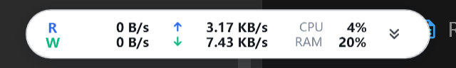
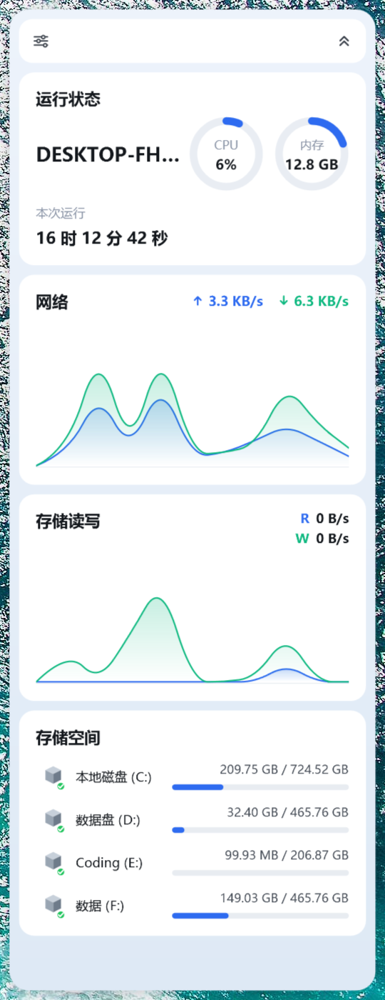

# DockGauge

[](https://github.com/zoup0512/DockGauge/actions/workflows/release.yml)

> Windows 桌面性能监视悬浮窗 —— NAS 面板风格的 CPU / 内存 / 网络 / 磁盘监控小部件
>
> A floating performance monitor widget for Windows, styled after NAS dashboards.

<p align="center">
  
</p>
<p align="center">
  
</p>

## 特性

- **紧凑悬浮条**：常驻桌面（置顶、可拖动），一屏看清磁盘 R/W 速度、网络 ↑/↓ 速度、CPU / RAM 占用
- **展开面板**：点击悬浮条箭头展开
  - 运行状态：主机名、CPU / 内存环形仪表、本次运行（开机）时长
  - 网络：上 / 下行速率 + 实时曲线（近 100 秒，自适应纵轴）
  - 存储读写：R / W 速率 + 实时曲线
  - 存储空间：各本地磁盘已用 / 总容量与进度条
- **右键菜单**（或顶栏设置按钮）：置顶显示、开机自启、退出
- **系统托盘**：左键点击托盘图标显示 / 隐藏悬浮窗；右键菜单可切换面板、置顶、开机自启、退出。
  托盘图标默认收在任务栏角溢出区，可在 *任务栏设置 → 其他系统托盘图标* 中设为常显
- 窗口位置与配置自动保存在 `%LOCALAPPDATA%\DockGauge\config.json`
- 无边框透明窗口 + 自绘控件，无第三方 UI 依赖，安装包极小

## 下载

到 [Releases](https://github.com/zoup0512/DockGauge/releases) 下载 `DockGauge-vX-win-x64.zip`，解压后运行 `DockGauge.exe` 即可（免安装；需要 [.NET Desktop Runtime 8](https://dotnet.microsoft.com/download/dotnet/8.0) 或更高版本）。版本历史见 [CHANGELOG.md](CHANGELOG.md)。

## 构建与运行

**环境要求**：Windows 10 / 11、[.NET 8 SDK](https://dotnet.microsoft.com/download/dotnet/8.0)（仅构建需要，运行只需 .NET Desktop Runtime 8）

```bash
git clone https://github.com/zoup0512/DockGauge.git
cd DockGauge
dotnet build -c Release
./src/DockGauge/bin/Release/net8.0-windows/DockGauge.exe

# 直接以展开面板启动（调试用）
./src/DockGauge/bin/Release/net8.0-windows/DockGauge.exe --expanded
```

启动后悬浮条停靠在屏幕右上角，按住可拖动到任意位置；点击右侧箭头切换紧凑 / 展开视图。

## 工作原理

数据采集全部使用系统自带能力，与系统显示语言无关，每秒刷新一次：

| 指标 | 采集方式 |
| --- | --- |
| CPU 占用 | `GetSystemTimes` 前后差值 |
| 内存 | `GlobalMemoryStatusEx` |
| 网络上下行 | 各活动网卡 `GetIPv4Statistics` 差值求和（排除回环 / 隧道） |
| 磁盘读写 | WMI `Win32_PerfFormattedData_PerfDisk_PhysicalDisk` |
| 磁盘容量 | `DriveInfo`（固定磁盘） |
| 开机时长 | `GetTickCount64` |

界面为无边框透明 WPF 窗口（`AllowsTransparency`），两个自绘控件：

- `Sparkline`：平滑面积折线图（中点二次贝塞尔），Y 轴按窗口内峰值自适应
- `RingGauge`：环形进度仪表（圆头弧线 + 中心双行文字）

## 目录结构

```
DockGauge/
├── DockGauge.sln
├── src/DockGauge/
│   ├── DockGauge.csproj
│   ├── App.xaml(.cs)            # 入口、单实例
│   ├── MainWindow.xaml(.cs)     # 紧凑条 + 展开面板、采样循环、菜单、配置
│   ├── Controls/
│   │   ├── Sparkline.cs         # 平滑面积折线图
│   │   └── RingGauge.cs         # 环形进度仪表
│   └── Services/
│       ├── MetricsService.cs    # 系统指标采样
│       └── Fmt.cs               # 字节 / 速率 / 时长格式化
└── docs/                        # 截图
```

## License

[MIT](LICENSE)
